# Git Extensions — cross-platform (Linux) port

A ground-up Avalonia UI for Git Extensions on Linux that **reuses the existing
git-logic core** (`GitCommands`, `GitExtUtils`, `GitExtensions.Extensibility`,
`GitUIPluginInterfaces`) instead of the WinForms UI, which is Windows-only.

The engine is still git and the logic is still upstream's. What changed is the
interface — and, in the places listed below, what the application can do without
reaching for another program.

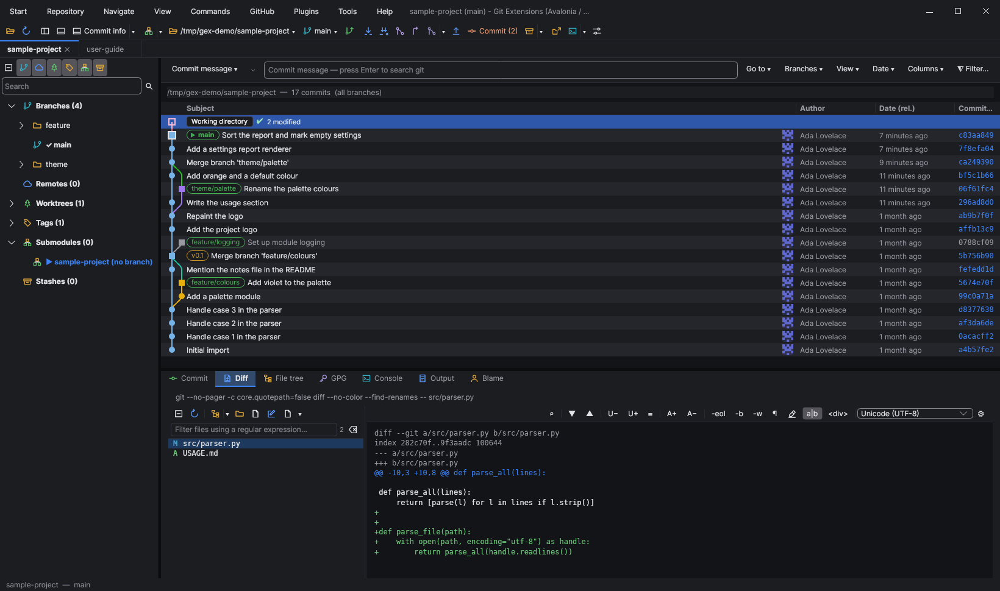

> Every screenshot on this page was taken from this build on a throw-away demo
> repository, on a virtual display, with the theme following the desktop's dark
> preference. Nothing is a mock-up.

---

## What is different from the original Git Extensions

### The interface is Avalonia, and Linux is the target

Upstream's UI is WinForms, which runs only on Windows: there is no retarget, so
the shell was rebuilt. The layout, the toolbar, the revision grid, the file
lists, the diff pane and the bottom tabs follow `FormBrowse` closely enough to be
recognisable, and the parts that are *not* recognisable are the ones a modern
Linux desktop expects instead.

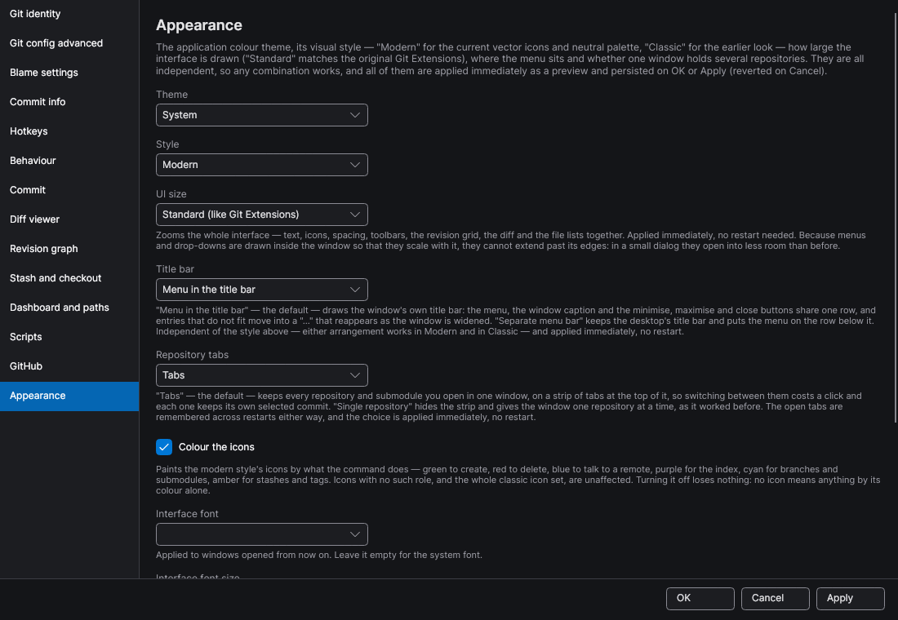

Each of those is independent, applied immediately as a preview, and persisted on
OK — reverted on Cancel:

| Setting | What it does |
|---|---|
| **Theme** | Light, Dark, or **System**. Upstream ships light and dark themes too, chosen by hand; **System** is new — it follows the desktop's own preference, live, through the XDG portal |
| **Style** | **Modern** (vector icon set, neutral palette, flat chrome) or **Classic** (the earlier look) |
| **UI size** | Zooms the whole interface — text, icons, spacing, grid, diff — with no restart |
| **Title bar** | Menu **inside** the window's own title bar (VS Code style, with a `…` overflow measured at runtime) or the desktop's title bar with a separate menu row |
| **Repository tabs** | One window holding several repositories, or one repository at a time as before |

#### The icons are drawn, not shipped

Upstream ships its icons as bitmap resources. This port draws them as vectors, so
they stay sharp at any UI size — and in Modern style it paints each
one by **what the command does**: green to create, red to delete, blue to talk to
a remote, purple for the index, cyan for branches and submodules, amber for
stashes and tags. Commands with no such role stay neutral.

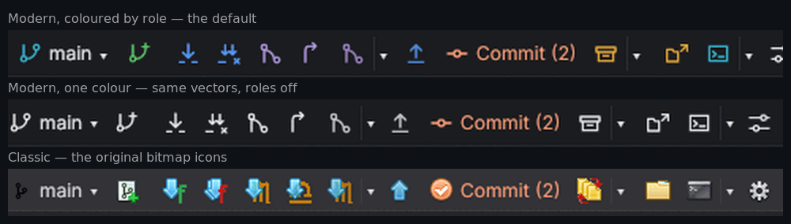

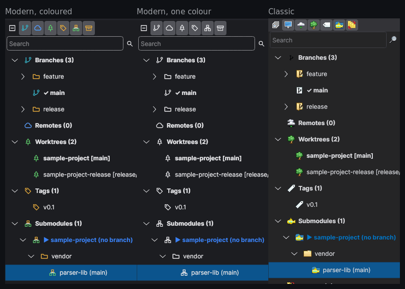

Three settings, one toolbar and one tree, nothing else changed between the rows.
The roles are a checkbox — turn it off and you keep the same vector set in one
colour — and the whole original bitmap set is still there under **Classic**, for
anyone who wants the interface they already know. Nothing is lost either way: no
icon means anything by its colour alone.

### One window, several repositories

This is the largest departure from upstream, where one repository means one
window. Here every repository you open — including the submodules and linked
worktrees of the one you are in — lands on a strip of tabs at the top, VS Code
style:

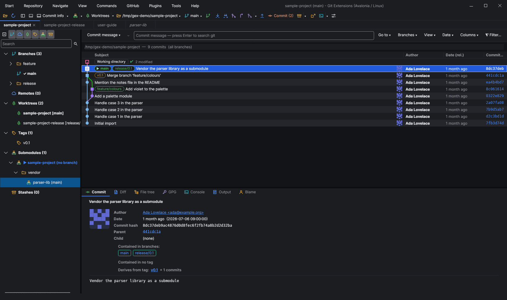

The behaviour is the one that strip trains you to expect:

- **A single click on a submodule or worktree opens a preview** — the italic tab.
  It is *replaced* by the next preview instead of piling up, so browsing through
  eight submodules leaves one tab behind, not eight.
- **A double click pins it.** So does dragging it, and so does opening a
  repository any other way (`Ctrl+O`, recent, favourites, clone).
- **Each tab keeps its own place**: the commit it had selected and the bottom tab
  it was on. Switching costs a click, not a reload — which is the point,
  because the alternative was one window per repository and a taskbar full of
  identically named windows.
- **Tabs are draggable** to reorder, `Ctrl+W` closes one, `Ctrl+PgUp` / `Ctrl+PgDn`
  cycle, and the open set is restored on the next start.
- **The same repository can be open twice.** "Duplicate tab" gives you two views
  of one repository — one on the branch you are writing, one on the history you
  are reading — and the labels number themselves so you can tell them apart:

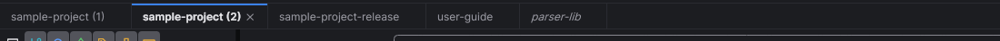

`sample-project (1)` and `(2)` are the same repository; `sample-project-release`
is a linked worktree of it; `user-guide` is a different project; `parser-lib` in
italic is the submodule opened as a preview. All in one window, one process, one
menu.

#### Colour says which checkout a tab came from

Two clones of one project are the case where labels alone give up. `~/work/api`
and `~/review/api` contain submodules with the same names, so their submodule tabs
carry the same word — and the strip's answer, lengthening each label until the
paths differ, produces two long strings whose difference sits in the *middle*.
That is read, not seen. So each tab also carries a 3-pixel chip in the colour of
its **checkout**: the outermost repository above it, which for a submodule is its
superproject.

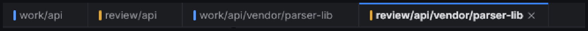

Blue is `~/work/api` and everything opened from inside it, amber is `~/review/api`
and everything from inside that one. Two clones, four tabs, and the question "am I
looking at the review copy?" answered without reading a path.

The chips follow the same rule as the labels — **disambiguate what is ambiguous
and leave the rest alone** — so with a single checkout open nothing is painted at
all. The colours come from the theme's own icon hues in the order each checkout
first appears, not from a hash of the path, so renaming a folder does not shuffle
them, and switching theme recolours them.

If you would rather have none of it, **Appearance → Repository tabs → Single
repository** hides the strip and gives the window one repository at a time, as it
worked before. The choice applies immediately, with no restart.

### Diffs, merges and image comparisons are done in-house

Upstream hands conflicts and side-by-side comparison to an external program — it
knows how to drive kdiff3, Meld, Beyond Compare, P4Merge, DiffMerge and Araxis,
and asks you to name one. That still works and is still offered here. But **with
nothing configured at all, none of it is unavailable**: the engine is git itself
(`git merge-file --diff3`, `git diff --no-index`), and the panels are the
application's own.

A real three-way merge editor — LOCAL, BASE and REMOTE read-only above, the
editable result below, per-character highlighting of what each side changed, and
one-click resolutions for whole-side or trivial (whitespace, line-ending,
blank-line) conflicts:

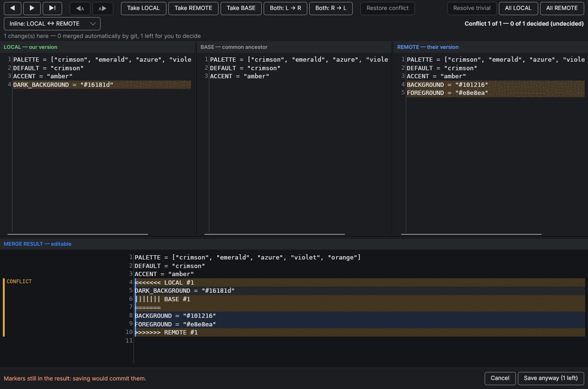

A side-by-side comparison of any two revisions of a file, aligned from git's own
hunk headers, with intra-line marks showing which *characters* moved:

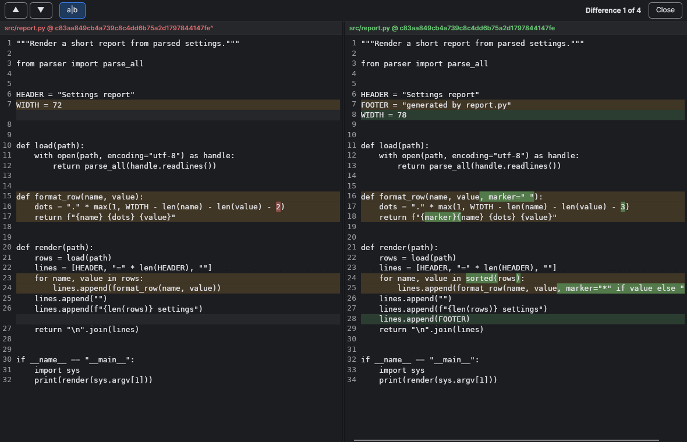

And images. Upstream's viewer already *shows* an image instead of the patch — what
it does not do is put the two revisions next to each other. This one compares them:
side by side, overlaid with adjustable opacity, or as a per-pixel difference, with
the dimensions and byte sizes named underneath. The format is recognised **from the
file's bytes**, not its extension, and a file that decodes only partially is
declared as `TRUNCATED FILE` rather than shown as an image with silently blank
rows — which is what a decoder does with a truncated PNG if nobody asks it.

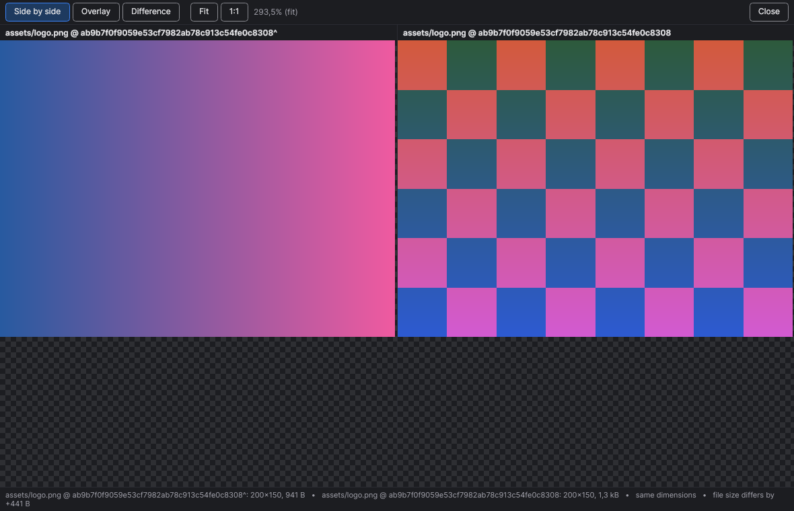

### Conflicts say what they are, and rerere is visible

Upstream's conflict window answers "there is no mergetool configured, please go to
settings and set a mergetool" — the resolution itself is somebody else's program.
Here the same window explains in one line what kind of conflict each file has and
which ways out exist, including the cases where a three-way merge is not possible
at all (deleted on one side, a submodule pointer, a symlink), and the **Merge**
button opens the editor above rather than looking for `merge.tool`.

`git rerere` is a checkbox in upstream's advanced git-config page and nothing more.
Here it is part of the flow: switched on from this window, reporting what it has
already replayed, with a window of its own for the cache and a `forget` that asks
first.

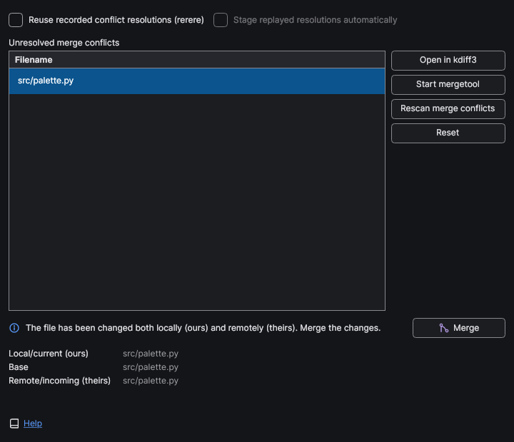

### The bar over a stopped operation says more

This one is **not** new: upstream has a bar for exactly this — bisect, rebase, merge
and patch, with *Resolve…*, *Continue*, *Abort* and a *More…* that opens the matching
dialog. The port keeps it and makes it say more, because the buttons alone leave you
guessing where in the operation you are:

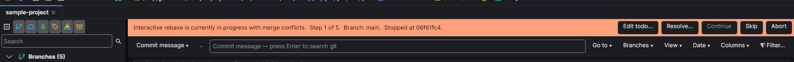

The state, **the step out of how many, the branch and the commit it stopped at**, and
*Skip* and *Edit todo…* on the bar rather than one dialog further in. And when a step
wants a message — `reword`, `squash`, a merge commit — declining the question is
reported as **cancelled** rather than as a failure: the operation is left exactly
where it was, resolutions still staged.

Upstream also has *Edit todo…*, which hands the todo file to a text editor (its own,
when Git Extensions is configured as git's editor). Here the same list is **rendered
as steps**, with the verbs as buttons and the consequence of each spelled out:

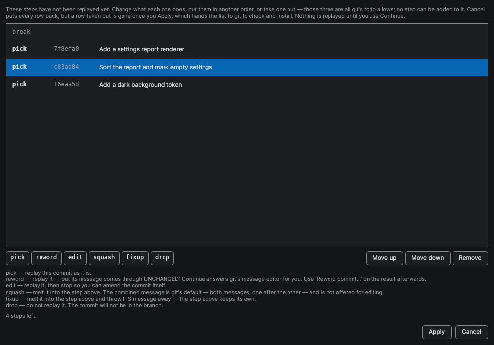

### A command palette over the real menu

`Ctrl+Shift+P` searches the menu itself — walked at open time, so availability is
decided by the same code that greys the menu out, and there is no second registry
to keep in sync. Commands that are unavailable here are shown greyed rather than
hidden, toggles show their state, shortcuts are listed, and recent choices come
back first.

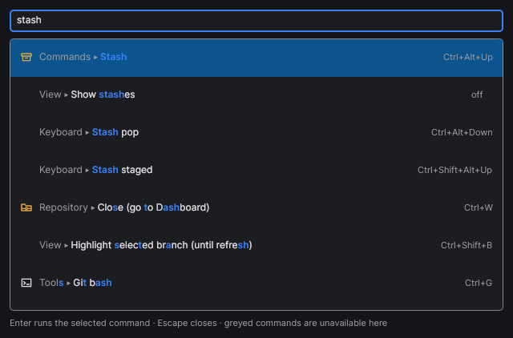

### A terminal inside the window, with nothing to install

Upstream has an embedded console too, and it gets there by hosting **ConEmu** (or
mintty) — a separate program, checked in as an external dependency, and Windows-only.
This port implements the terminal itself: a pty of its own, so the `Console` tab is
your shell in the repository's directory with nothing to install and nothing to
configure — colours, prompt, `less`, `git add -p`, anything. `Ctrl+G` still launches
an external terminal if you prefer one.

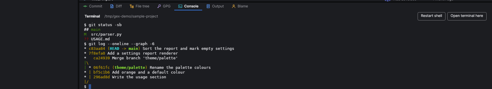

### The commit dialog, rebuilt

Staged and unstaged lists with their own filters, the diff of whatever is
selected on the right, staging by file or by selected lines, message templates,
amend, and the committer identity plus the push target named along the bottom.

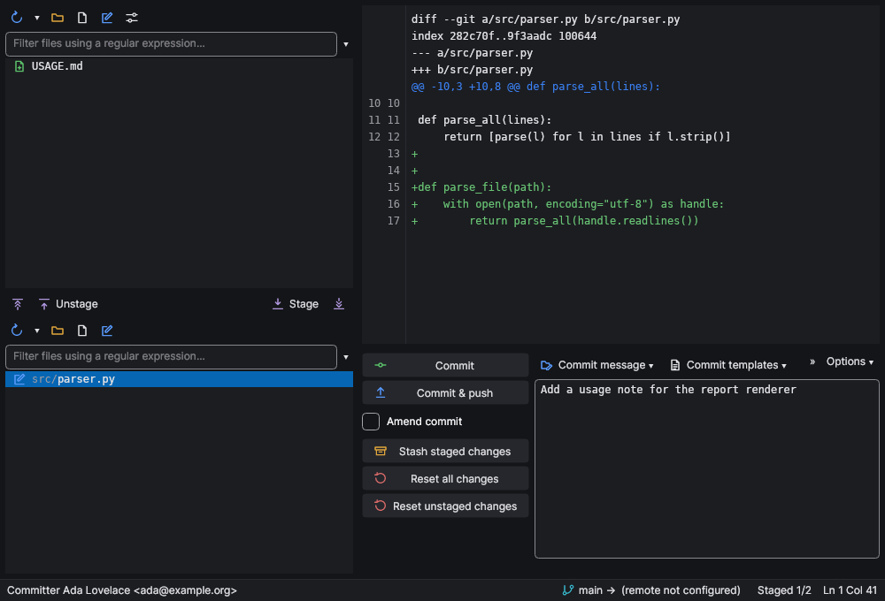

### Not everything here is a departure

Most of the application is upstream's design rebuilt, and this page is not the place
to claim otherwise. The commit dialog above is `FormCommit`; the window below is
`FormFileHistory`, with the same four tabs and the same rename following — put here
so that the shape of the port is visible, not because it is new:

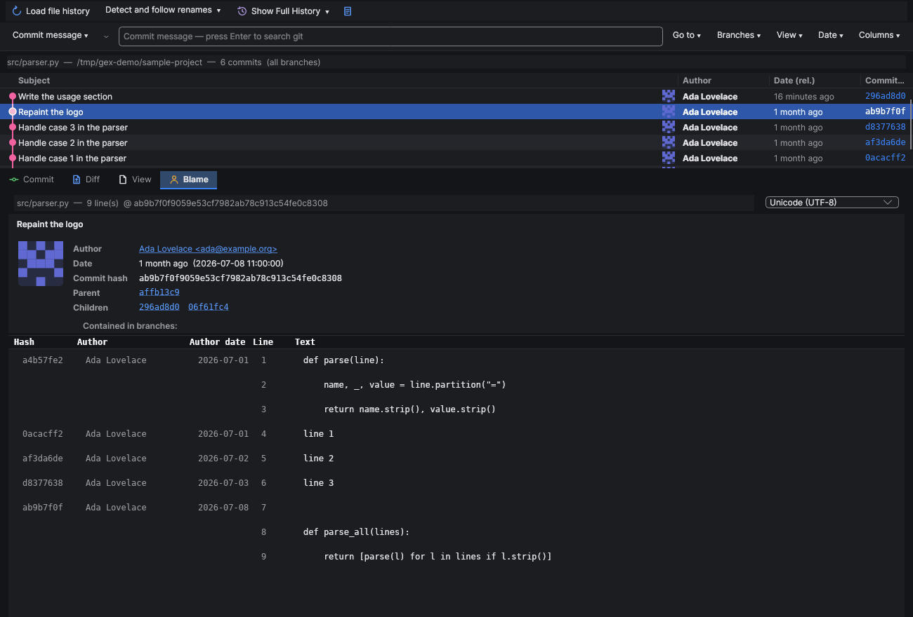

One detail inside it is different, and it is the kind that only shows on Linux: for a
file that was renamed, git does not rewrite parents under `--follow`, so the graph
arrived as a ladder of disconnected stumps. The port collects the historical names
first and then walks with those as the pathspec, which git *does* rewrite parents
for — one line of history instead of rubble.

### Settings are files, and they survive a crash

Everything the port stores of its own lives in JSON under
`$XDG_CONFIG_HOME/GitExtensions.Avalonia/` — window and view state, hotkeys,
favourites, scripts, commit-info columns. Every write is a **whole-document
atomic replacement under a side lock**, and every update sends a *delta* rather
than the document a window happened to load at start-up. Two copies of the
application running at once, or one of them killed mid-write, cannot leave a
truncated file behind — which would read as "no settings", i.e. a silent reset of
your theme, layout and shortcuts. There are regression harnesses for exactly
this, with real processes and `SIGKILL`.

Git's own configuration is still git's: the settings window writes it through
`git config`, at the level you choose.

### The port carries its own tests, because upstream's do not reach it

Upstream is well tested — `tests/app` and `tests/plugins` hold a large suite, and
`app-build.yml` runs it. None of it covers this tree: those tests build against the
WinForms solution, which does not contain a single one of these projects and mostly
does not compile on Linux. So the port has tests of its own.

Five regression harnesses (inline diff, command palette, view preferences, settings
stores, image integrity) plus the older probes and snapshots. `Tests/run-all.sh` runs
the seven deterministic ones, each in a sandbox of its own (isolated
`XDG_CONFIG_HOME` and `TMPDIR`, global and system git config silenced, a timeout per
harness, the scratch directory kept on failure because it is the evidence), and
`.github/workflows/crossplatform-build.yml` does that plus a `-warnaserror` build of
the whole solution on every push that touches the port. Excluded from the runner,
with the reason written down: the two probes that need a display, and the performance
measurement that is a timing rather than a verdict.

Everything else is verified on screen, and `PORTING.md` records how — including the
first CI run, which caught a harness that deadlocked only on a small machine.

### Smaller things you will notice

- **Grid column widths persist.** Both grids let you drag a column edge; upstream
  keeps which columns are *shown*, not how wide you made them, so every start-up
  measured them again.
- **Loading is visible**: a spinner over the grid and the tree, delayed by 250 ms so
  that the reloads which finish sooner than that never flicker one up.
- **GitHub is built in** rather than a plugin: fork and clone, add the upstream
  remote, list pull requests and create one. Upstream ships the same capability as
  `GitHub3`, one of the plugins — which is also why it can be switched off there and
  not here.
- **A `.deb`**: `packaging/build-deb.sh` produces a self-contained package that
  needs no .NET on the target, installs under `/opt/gitextensions`, and declares
  `git` as its only dependency.

## What is not here

Stated plainly, because a README that only lists wins is a sales page:

- **Plugins**: built-ins only. The shell extension, the Visual Studio
  integration and the Windows-only plugin surface are not ported and are not
  planned.
- **One deliberate deviation** in shortcuts: `QuickPull` moved to `Shift+F8`, to
  free `Ctrl+Shift+P` for the palette.
- Wayland is reached through XWayland; the X11 backend is what is tested.
- The **System** theme has not been exercised against a real desktop portal, only
  against the fallback path.
- The image comparison has no drag-pan or zoom shortcuts, and does not refuse
  images above 16 megapixels on screen (the check exists, it has not been driven
  through the UI).
- **Translations.** Upstream's catalogues are the port's catalogues, and every new
  string is keyed into them — but the strings this port added have no translations
  yet, so they read in English even in a translated build.
- The commit picker upstream offers on four fields (rebase, cherry-pick, archive,
  compare) is wired to one of them here.
- Assorted measured-and-recorded gaps: right-to-left tab labels eliding awkwardly,
  rerere untested with a multi-variant cache or non-ASCII paths, submodule conflicts
  with objects missing on one side.

`ROADMAP.md` keeps that list current, with what was measured and what was only
reasoned about. `PORTING.md` is the milestone-by-milestone record, `HANDOFF.md`
the working state.

---

## How the reuse works

The reusable core targets `net10.0-windows` in the real solution only because the
repo-root `Directory.Build.props` forces `UseWindowsForms=true` globally. This
tree is a **separate, isolated build** (its own `Directory.Build.props` that does
NOT import the repo root) that:

- Compiles the same source files under plain **`net10.0`** (no WinForms).
- Supplies a small **compat shim assembly** (`Compat.WinFormsShims`) that
  declares the minimal `System.Windows.Forms` / `System.Drawing` (GDI) surface the
  core touches, so those files compile unmodified. `System.Drawing` primitives
  (Point/Color/Size/Rectangle/SystemColors) come from the runtime, not the shim.
- Excludes the genuinely WinForms/Win32/GDI parts of `GitExtUtils/GitUI/`
  (Theming, Interops, ToolStrip/DPI helpers) and keeps the portable threading
  helpers (`ThreadHelper`, `TaskManager`).
- Provides an **Avalonia** front-end (`App/`) that drives the reused core.

The only edit to existing repo source is in `GitCommands/Settings/AppSettings.cs`:
Windows-registry reads/writes are guarded with `OperatingSystem.IsWindows()`
(no-ops off Windows). Windows behavior is unchanged.

## Projects

| Project | Purpose |
|---|---|
| `Compat.WinFormsShims` | Minimal WinForms/GDI stand-ins so the core compiles |
| `Core.Extensibility` | = `GitExtensions.Extensibility` under net10.0 |
| `Core.GitExtUtils` | portable parts of `GitExtUtils` (+ threading bootstrap) |
| `Core.GitUIPluginInterfaces` | = `GitUIPluginInterfaces` under net10.0 |
| `Core.GitCommands` | = `GitCommands` (all git logic) under net10.0 |
| `App/GitExtensions.Avalonia` | the Avalonia UI |
| `Tests/*` | ten harness projects; `GitExtensions.Avalonia.slnx` builds them all |

## Build & run

### On Linux

```bash
export DOTNET_ROOT="$HOME/.dotnet" PATH="$HOME/.dotnet:$PATH"
cd src/crossplatform

# Build the app (builds the whole core chain).
dotnet build App/GitExtensions.Avalonia.csproj

# Headless self-test — proves the reused git core works on Linux (no display).
DLL=$(find bin -name GitExtensions.Avalonia.dll | head -1)
dotnet "$DLL" --selftest /path/to/a/git/repo

# GUI (needs X11, or XWayland under a Wayland session).
./run.sh /path/to/a/git/repo

# Build everything and run the deterministic harnesses.
dotnet build GitExtensions.Avalonia.slnx -c Debug -warnaserror
Tests/run-all.sh --no-build
```

A `.deb` for a machine with no .NET installed: `packaging/build-deb.sh`, then
`sudo apt install ./packaging/out/gitextensions_<version>_amd64.deb`. See
`packaging/README.md`.

### On Windows

Same portable build, nothing extra to install. A `dotnet` on `PATH` is all it
needs — the `DOTNET_ROOT` export above is not a requirement, only an artifact of
the Linux box it was written on having a user-local SDK.

```powershell
cd src\crossplatform

# Build the app (builds the whole core chain).
dotnet build App\GitExtensions.Avalonia.csproj

# Headless self-test — same as above, no window needed.
dotnet bin\GitExtensions.Avalonia\Debug\net10.0\GitExtensions.Avalonia.dll --selftest C:\path\to\a\git\repo

# GUI.
dotnet run --project App\GitExtensions.Avalonia.csproj

# Standalone build for a machine with no .NET installed.
dotnet publish App\GitExtensions.Avalonia.csproj -c Release -r win-x64 --self-contained
```

`dotnet build` already emits a native `GitExtensions.Avalonia.exe` launcher next
to the assemblies, but it needs the .NET 10 shared runtime; the `publish` line
above bundles the runtime instead. It lands in
`dist\<configuration>\<rid>\` (gitignored) — `dist\Release\win-x64\` here, or
`dist\<configuration>\portable\` when no `-r` is given. Pass `-o` to override,
as `packaging/build-deb.sh` does.

Do **not** add `-p:PublishSingleFile=true`. It does not achieve a single file
anyway — Skia, ANGLE and HarfBuzz stay beside the executable as separate native
DLLs — and it empties `Assembly.Location`, which is how the core
`Translator.GetTranslationDir()` finds the `Translation` directory. The path
degrades to a *relative* `"Translation"`, resolved against the working
directory, so every catalogue silently becomes unreachable and the UI falls back
to English with no error.

Piping the self-test into `Select-Object -First N` makes it report exit 255.
That is PowerShell closing the stream early, not a failure — run it unpiped, or
pipe through `Out-String`, and it exits 0.
